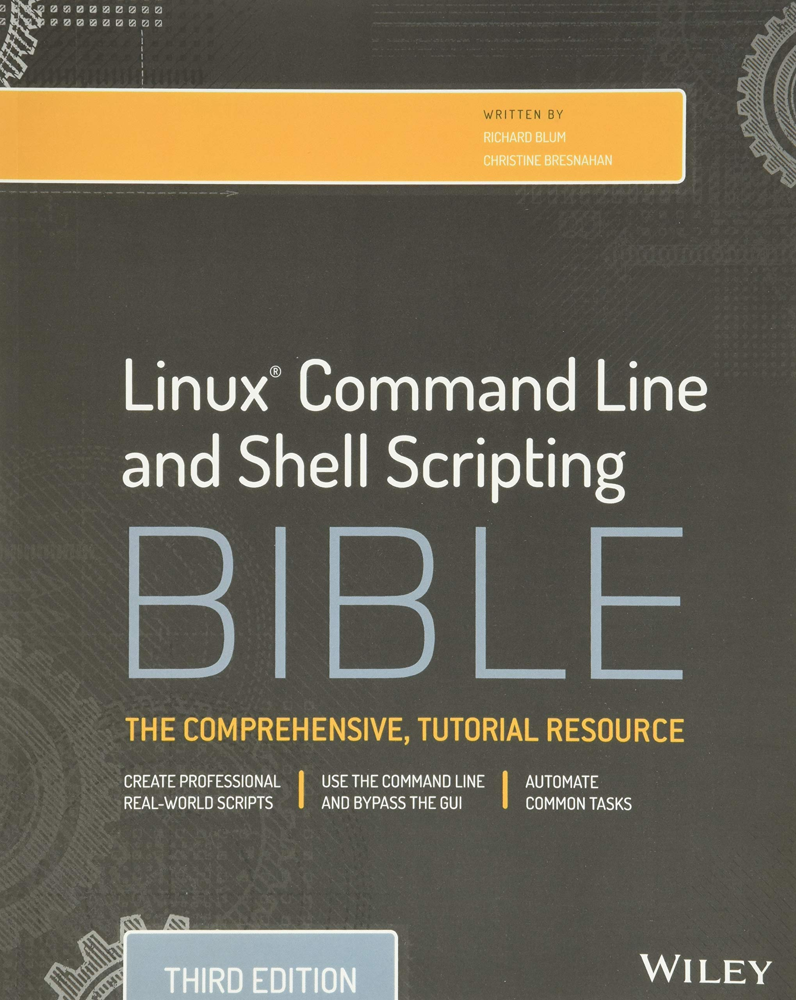

# Linux® Command Line and Shell Scripting Bible (Third Edtion)
 

	

 
 

# Book Description
**Talk directly to your system for a faster workflow with automation capability**

Linux Command Line and Shell Scripting Bible is your essential Linux guide. With detailed instruction and abundant examples, this book teaches you how to bypass the graphical interface and communicate directly with your computer, saving time and expanding capability. This third edition incorporates thirty pages of new functional examples that are fully updated to align with the latest Linux features. Beginning with command line fundamentals, the book moves into shell scripting and shows you the practical application of commands in automating frequently performed functions. This guide includes useful tutorials, and a desk reference value of numerous examples.

The Linux command line allows you to type specific shell commands directly into the system to manipulate files and query system resources. Command line statements can be combined into short programs called shell scripts, a practice increasing in popularity due to its usefulness in automation. This book is a complete guide providing detailed instruction and expert advice working within this aspect of Linux.

* Write simple script utilities to automate tasks
* Understand the shell, and create shell scripts
* Produce database, e-mail, and web scripts
* Study scripting examples ranging from basic to advanced
  
Whether used as a tutorial or as a quick reference, this book contains information that every Linux user should know. Why not learn to use the system to its utmost capability? Linux is a robust system with tremendous potential, and Linux Command Line and Shell Scripting Bible opens the door to new possibilities.
 
 

# All The Scripts
The scripts here are not the exact scripts in the book and i have modified some of them based on my opinion.  
Here are all of the scripts that book has, all the snippets are converted to a corresping script.
  

## Custom Scripts
In custom-scripts directory i've added some of my custom scripts that i liked.
 
 

# Downloading sample codes from official website
You can download script files from [Here](https://www.wiley.com/en-gb/Linux+Command+Line+and+Shell+Scripting+Bible%2C+3rd+Edition-p-9781118983843#downloads-section)
 
